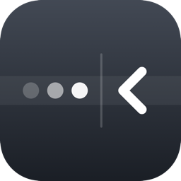
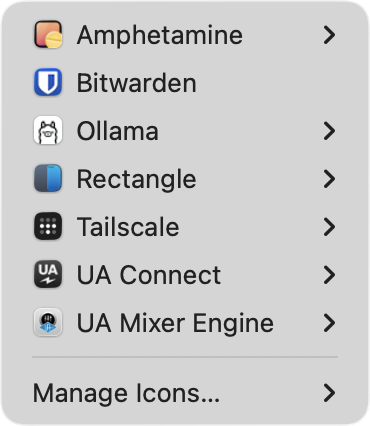

<h1 align="center">
  <br>
  Curtain
</h1>

<p align="center">
  <b>Hide the menu bar icons you never click.</b><br>
  Click the chevron to get them back — with their real menus, without moving a thing.
</p>

<p align="center">
  
</p>

<p align="center">
  <i>And unlike the alternatives, it cannot lose an icon.</i>
</p>

---

## Install

```sh
mkdir -p ~/Code && cd ~/Code
git clone https://github.com/nicholaspsmith/StatusItemKit.git
git clone https://github.com/nicholaspsmith/HotkeyKit.git
git clone https://github.com/nicholaspsmith/menubar-curtain.git
cd menubar-curtain && ./install.sh
```

That builds it, drops it in `~/Applications`, and launches it. Grant Accessibility
when prompted — it is how Curtain reads where icons sit and what hidden apps'
menus contain.

Then **⌘-drag the chevron** so everything you want hidden sits to its left. Or let
the app do the dragging: right-click ▸ Manage Icons.

Requires macOS 13+ and Swift 5.9. Quit Ice or Bartender first — two managers
fighting over the same icons will strand one.

## Using it

| | |
|---|---|
| **Left click** | the hidden icons, each with its own live menu |
| **Right click** | Manage Icons, reveal behaviour, Start at Login, Quit |

A hidden app's submenu is its **real menu**, read live while its icon sits
off-screen — so a hidden app stays completely usable and nothing on your bar
moves. Apps that publish no menu open directly instead. Hide an icon and unhide
it later and it returns to the exact slot it left.

## Why it cannot lose an icon

Curtain hides by **width**. A status item of its own grows leftward, sliding its
neighbours off the display. Items to its right never move, and no other app's
state is written.

That matters because the usual approach is to *move* other apps' icons, and
moving is where they get lost. This project exists because an icon vanished: the
app was healthy, its item present, the accessibility API reporting a real 32×24
slot — but the slot sat nine points from the notch, and that sliver renders
nothing. Ice had dragged it there and never checked. Quitting Ice made the same
mistake in reverse, restoring three icons straight into the notch, all invisible.

So Curtain moves an icon only when you ask it to, once, and always reads back
where it landed. Anything resting somewhere invisible gets named in the menu
rather than silently disappearing.

## Migrating off Ice

```sh
./scripts/snapshot-positions.sh     # capture every icon's position first
```

Then quit Ice and stop it launching at login. It registers via `SMAppService`, so
there is no LaunchAgent to remove — either switch it off in System Settings ▸
General ▸ Login Items, or move the app aside:

```sh
mv /Applications/Ice.app ~/.disabled-apps/
```

**Rollback:** move `Ice.app` back, run the generated `restore-positions.sh`, and
relaunch the affected apps — positions are read when an app creates its status
item, so each needs a restart to pick them up.

## Known limits

- **The bar has a capacity.** Making an app visible when the strip is already full
  pushes something into the notch sliver, where it draws nothing. Curtain names
  whatever lands there, but it cannot create room — hide something in exchange.
- **Some apps are invisible to accessibility.** Mullvad and Raycast publish no
  status item at all, so they can be hidden but not listed or arranged for.
- **Shortcuts depend on the app.** Rows show key equivalents where an app sets
  them; Rectangle registers global hotkeys instead, so it publishes none.
- **Main display only.**

## Design notes

`docs/superpowers/` carries the design and the plan, including the measurements
behind every constant — why a status item must fit entirely right of the notch to
render at all, why an app cannot trust its own item's window frame, and why
yielding by width rather than `isVisible` is the only way to keep a placement.
